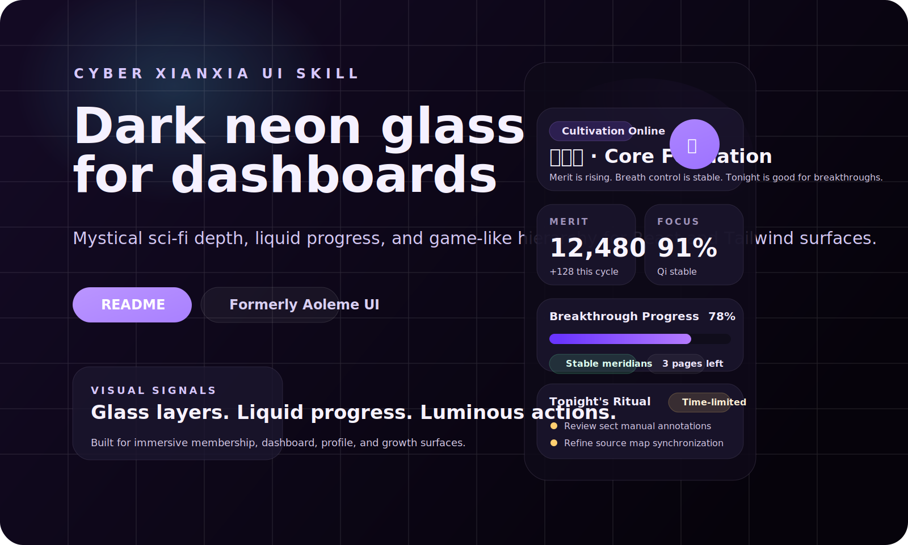

# Cyber Fantasy UI Skill / 赛博奇幻 UI Skill

> Formerly Aoleme UI. A discoverable OpenClaw skill for dark neon dashboards, glassmorphism-heavy interfaces, and gamified React or Tailwind UI generation.
>
> 原名 Aoleme UI。一个更容易被搜索发现的 OpenClaw 设计类 skill，适合生成暗色霓虹、玻璃拟态、游戏化的 React / Tailwind 界面，整体风格更偏“赛博奇幻”而不是直接使用 xianxia 术语。

<p align="center">
  
  
  
  
</p>

## Demo / 效果预览



- Preview file: [`demo/index.html`](./demo/index.html)
- Demo stylesheet: [`demo/styles.css`](./demo/styles.css)

这个 demo 展示了这套 skill 的典型视觉语言：深色背景、修仙紫主色、液态进度、玻璃面板、状态徽标和偏游戏化的信息层次。

This demo shows the core visual language of the skill: dark layered surfaces, cultivation-purple accents, liquid progress treatments, glass panels, status chips, and game-like information hierarchy.

## What This Skill Does / 这个 Skill 是做什么的

Use this skill when you want OpenClaw to:

- design a dark, mystical, game-like dashboard
- restyle an existing React or Tailwind page into a cyber-fantasy direction
- apply glow, glass surfaces, liquid progress bars, and immersive UI patterns consistently

适合这些场景：

- 仪表盘
- 会员中心
- 成长体系
- 活动页
- 个人主页
- 状态面板

Not for:

- backend logic or API workflows
- conservative enterprise products unless the user explicitly wants this aesthetic

不适合：

- 后端逻辑、接口流程、数据处理
- 已有严格品牌规范且不希望明显改变视觉方向的产品

## Example Prompts / 示例 Prompt

- Design a cyber-fantasy dashboard for a habit tracker using React and Tailwind.
- Restyle this page into a dark neon glassmorphism UI with purple glow and liquid progress bars.
- Build a gamified profile screen with merit points, cultivation levels, and mystical status cards.
- Create an immersive mobile event page with dark glass panels and restrained sci-fi motion.
- Turn this plain admin interface into a game-like dashboard without changing its data model.

- 用 React 和 Tailwind 做一个赛博奇幻风格的习惯打卡仪表盘。
- 把这个页面改造成暗色霓虹玻璃拟态界面，带紫色发光和液态进度条。
- 做一个带功德值、境界等级和状态卡片的游戏化个人主页。
- 做一个移动端优先的沉浸式活动页，保留现有数据结构但整体风格改成修仙科技感。

## Why This Skill / 为什么值得用

- It gives the agent a concrete visual target instead of vague prompts like "make it cooler".
- It includes reusable Tailwind tokens and CSS utilities rather than only a style description.
- It encourages selective adaptation instead of destructive redesign.
- It warns against risky global rules such as forcing `overflow: hidden` across an entire app.

- 它给 agent 的不是模糊审美方向，而是一套明确可执行的视觉目标。
- 它不只是风格文案，还附带可复用的 Tailwind 配置和 CSS 工具类。
- 它强调“贴着宿主项目落地”，而不是粗暴替换整个设计系统。
- 它明确规避了一些危险的全局规则，例如无差别地设置 `overflow: hidden`。

## Included Files / 仓库内容

- `SKILL.md` - skill 入口、触发条件、执行规则
- `resources/tailwind.config.js` - 颜色、字体、动画、keyframes
- `resources/global.css` - 玻璃拟态、液态进度、发光和性能辅助样式
- `demo/index.html` - 可本地打开的静态 demo
- `demo/styles.css` - demo 样式
- `demo/preview.svg` - README 预览图
- `PUBLISHING.md` - 本地验证与发布步骤

## Install / 安装方式

### Shared install / 全局安装

```bash
mkdir -p ~/.openclaw/skills/cyber_fantasy_ui
rsync -av ./ ~/.openclaw/skills/cyber_fantasy_ui/
```

### Workspace install / 工作区安装

```bash
mkdir -p <your-project>/skills/cyber_fantasy_ui
rsync -av ./ <your-project>/skills/cyber_fantasy_ui/
```

Start a new OpenClaw session after installing.

安装后建议新开一个 OpenClaw session。若你的 OpenClaw 只扫描工作区根目录，请复制目录，不要使用 symlink。

## Verify / 验证

```bash
openclaw skills info cyber_fantasy_ui --json
openclaw skills list --json
```

Expected:

- `name` is `cyber_fantasy_ui`
- `eligible` is `true`
- the description mentions cyber-fantasy, dark neon, or gamified UI

验证通过时应看到：

- `name` 为 `cyber_fantasy_ui`
- `eligible` 为 `true`
- 描述中出现 cyber-fantasy、dark neon、gamified UI 等关键词

## Manual Use Without OpenClaw / 不接 OpenClaw 也能用

1. Merge the needed parts of `resources/tailwind.config.js` into your Tailwind config.
2. Copy or import the utilities from `resources/global.css`.
3. Use `demo/` as a style reference and reuse the guidance from `SKILL.md`.

1. 把 `resources/tailwind.config.js` 中需要的 token 合并进你的 Tailwind 配置。
2. 复制或按需引入 `resources/global.css`。
3. 把 `demo/` 当作视觉参考，同时复用 `SKILL.md` 中的落地规则。

## Naming / 命名说明

Public-facing name:

- `Cyber Fantasy UI Skill`

Internal skill key:

- `cyber_fantasy_ui`

Legacy alias kept in docs:

- `Aoleme UI`
- `Cyber Xianxia UI Skill`

对外展示名改成了更容易被英文用户理解和搜索的 `Cyber Fantasy UI Skill`，内部 skill key 改为 `cyber_fantasy_ui`，文档中保留 `Aoleme UI` 和 `Cyber Xianxia UI Skill` 作为历史别名，便于老用户识别。

## Publish / 发布

```bash
git add .
git commit -m "Rename skill to cyber_fantasy_ui"
npx clawhub login
npx clawhub publish . --slug cyber-fantasy-ui --name "Cyber Fantasy UI Skill" --version 1.1.1
```

If `clawhub` fails under your current Node version, switch to an LTS runtime such as Node 20 and retry.

如果 `clawhub` 在你当前 Node 版本下报错，先切到 Node 20 之类的 LTS 版本再发。

## License / 许可证

[MIT](./LICENSE) © 2026 isdou
